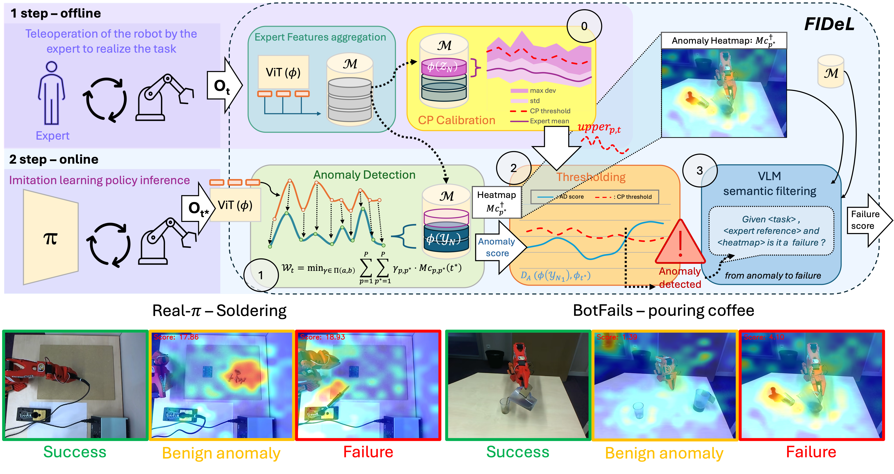

# [FIDeL] - Failure Identification in Imitation Learning via Statistical and Semantic Filtering


[Quentin Rolland](https://quentinrolld.github.io/)<sup>1,2</sup>,
[Fabrice Mayran de Chamisso](https://fabricemdc.ocfmcreation.com/)<sup>1</sup>,
[Jean-Baptiste Mouret](https://members.loria.fr/JBMouret/)<sup>2,3</sup>

<sup>1</sup>Université Paris-Saclay, CEA, List, F-91120, Palaiseau, France,
<sup>2</sup>Inria, CNRS, Université de Lorraine, LORIA, F-54000 Nancy, France,
<sup>3</sup>Bleu Robotics, Paris, France

*IEEE International Conference on Robotics and Automation (ICRA), 2026*

<a href='https://cea-list.github.io/FIDeL/'></a> <a href='https://arxiv.org/abs/2604.13788'></a>

The official code repository for *"Failure Identification in Imitation Learning via Statistical and Semantic Filtering,"* presented at ICRA 2026.



---

## Overview

Imitation Learning (IL) policies are brittle to rare or out-of-distribution events in real-world robotic deployments.  
We introduce **FIDeL**, a policy-agnostic failure identification framework that combines:

- Vision-based anomaly detection
- Optimal transport alignment with expert demonstrations
- Spatio-temporal thresholding via conformal prediction
- Semantic filtering using Vision-Language Models (VLMs)

FIDeL detects, localizes, and semantically filters failures in real time, without interfering with policy execution.

---

## 🛠️ Setup & Installation

1. **Clone the repository:**
   ```bash
   git clone https://github.com/CEA-LIST/FIDeL.git
   cd FIDeL
   ```

2. **Setup the Python Environment:**
   You can quickly set up the virtual environment using the provided script:
   ```bash
   conda env create -f environment.yml
   conda activate fidel-env
   ```

---

## 🗂️ Data Preparation (BotFails Dataset)

Because the raw datasets and extracted features are too heavy for a standard Git repository, we host them externally.

**To download the dataset:**
1. Ensure your virtual environment is activated (it contains `gdown`).
2. Run the provided download script from the root of the repository:
   ```bash
   bash download_data.sh
   ```

This script will automatically download the required tasks (e.g., `soldering_2`, etc.) and extract them into a `data/` folder at the root of the project, which is automatically ignored by Git.

---

## 🚀 Usage

You can run the full evaluation pipeline using the `main.py` script located in the `src/` directory. The underlying scripts rely on [Hydra](https://hydra.cc/) for configuration, allowing you to pass overrides directly from the command line. Alternatively, you can directly modify the parameters in the cfg file.

```bash
cd src
python main.py --task_name domotic_setTheTable_anomaly --labels_dir ../../Labels --score_dir ../results/score
```

This single entry point will sequentially execute:
1. **Memory Initialization (`store_memory_data.py`)**: Aggregates expert demonstrations to build a normal latent statistical memory.
2. **Evaluation (`eval.py`)**: Evaluates the learned models on anomaly datasets and extracts anomaly scores using global conformal prediction.
3. **Metrics Computation (`plot/compute_threshold_score.py`)**: Computes robust failure detection metrics (AUROC, F1, MCC) against ground truth labels.

**Customizing configurations:**
You can easily swap out the encoder (e.g. `resnet18`, `dinoV2`) or the thresholding type (e.g. `conformal_prediction_global`, `conformal_prediction_time`) directly via the command line:
```bash
python main.py --task_name soldering_2_anomaly encoder=resnet18 threshold_type=conformal_prediction_global
```

---

## BotFails Dataset

We also introduce **BotFails**, a multimodal dataset for robotic failure detection:

- Vision, proprioception, and language instructions
- 646 video sequences
- 414,359 annotated frames
- Real-world manipulation and interaction tasks
- Explicit failure and benign anomaly annotations

---

## Results

FIDeL outperforms state-of-the-art anomaly detection baselines on BotFails, achieving:

- **+5.30% AUROC** in anomaly detection
- **+17.38% accuracy** in failure identification

Qualitative results and videos are available on the project webpage.

---

## Citation
If you find FIDeL useful, please consider citing our work:
```
@inproceedings{rolland2026failure,
  title={Failure Identification in Imitation Learning via Statistical and Semantic Filtering},
  author={Rolland, Quentin and Mayran de Chamisso, Fabrice and Mouret, Jean-Baptiste},
  booktitle={IEEE International Conference on Robotics and Automation (ICRA)},
  year={2026},
}
```


## Acknowledgments
Parts of this project page were adopted from the [Nerfies](https://nerfies.github.io/) page.

## Website License
<a rel="license" href="http://creativecommons.org/licenses/by-sa/4.0/"></a><br />This work is licensed under a <a rel="license" href="http://creativecommons.org/licenses/by-sa/4.0/">Creative Commons Attribution-ShareAlike 4.0 International License</a>.
